# Options catalog

Every visual option, captured from the same fixture shots so only the
option changes between images in a group. Generated by
`npm run catalog` from scripts/catalog.config.mjs; do not edit by
hand. The same catalog is deployed next to the
[live demo](https://chayuto.github.io/golf-shot-viz/catalog/).

## mode

studio draws every full trajectory for analysis. showcase is the replay view; trajectories reveal over time. Shown mid volley replay.

| `studio` (default) | `showcase` |
| --- | --- |
|  | 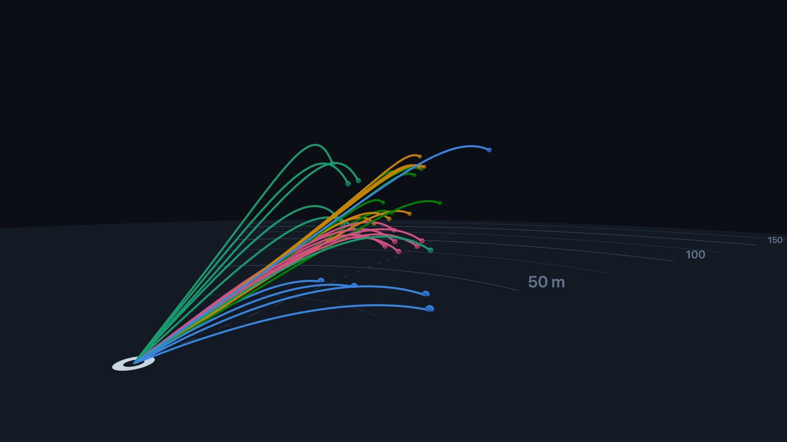 |

## cameraPreset

Framing presets sized to the data extent. Also settable at runtime with setCameraPreset, which flies the camera over.

| `broadcast` (default) | `behind` | `side` |
| --- | --- | --- |
|  | 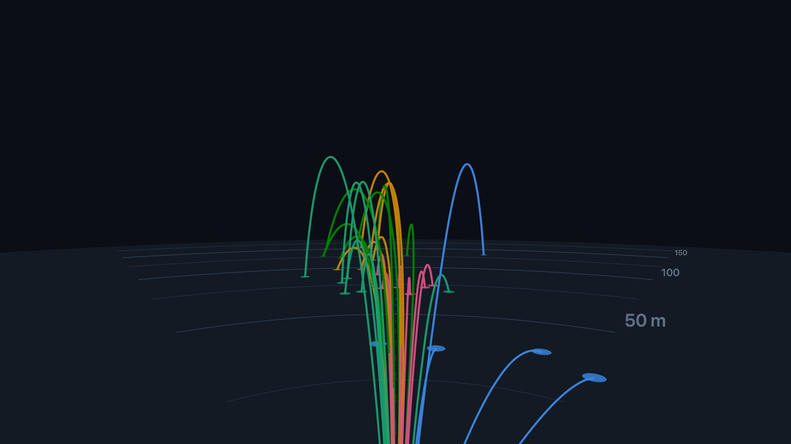 | 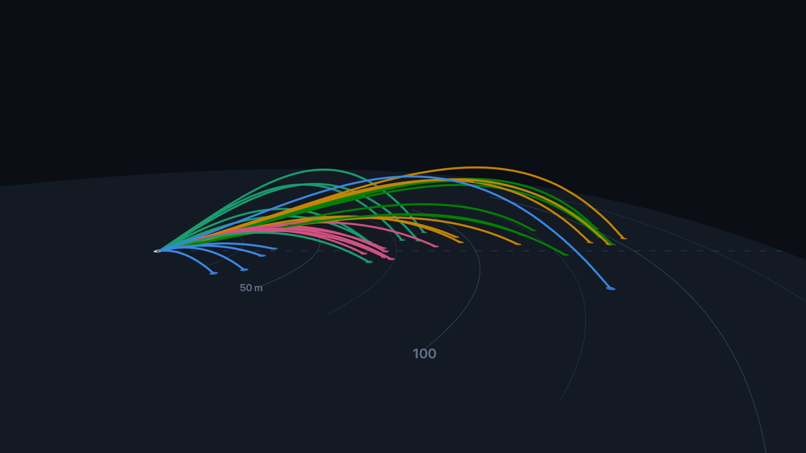 |

| `top` | `green` |
| --- | --- |
| 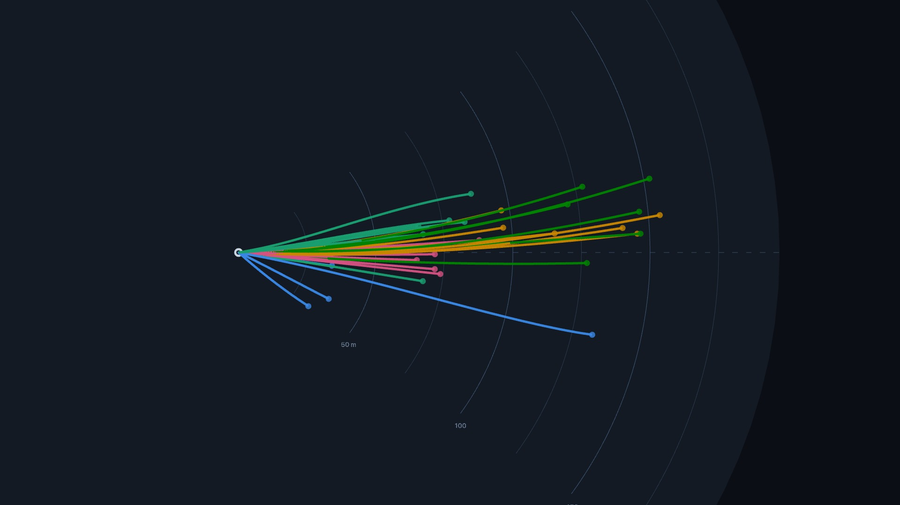 | 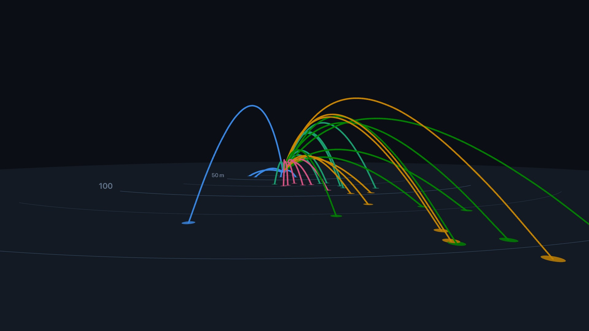 |

## colorBy

How tracer colors are assigned when shots carry no explicit color. club and session take fixed palette slots in order of first appearance. index cycles the palette per shot.

| `club` (default) | `session` | `index` |
| --- | --- | --- |
|  | 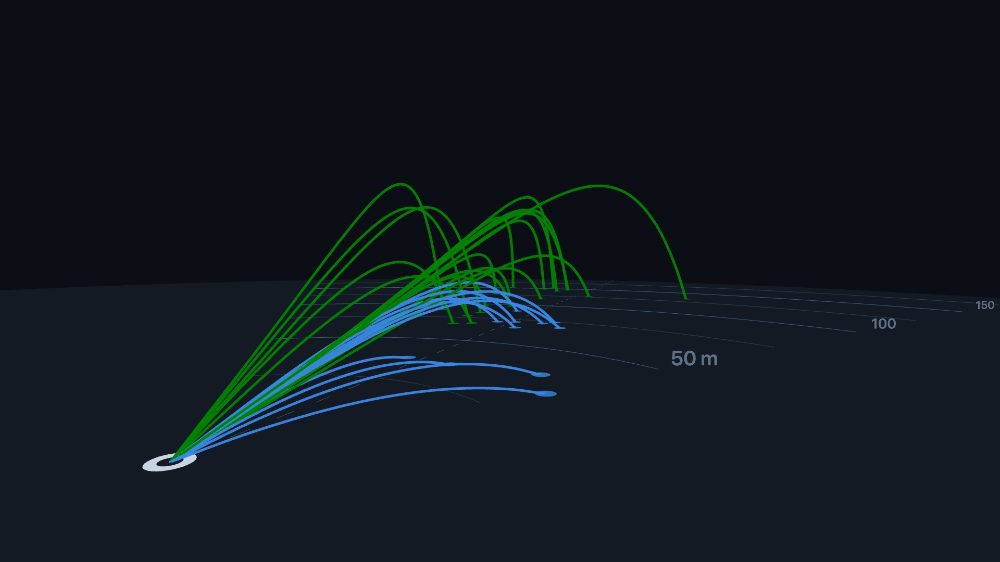 | 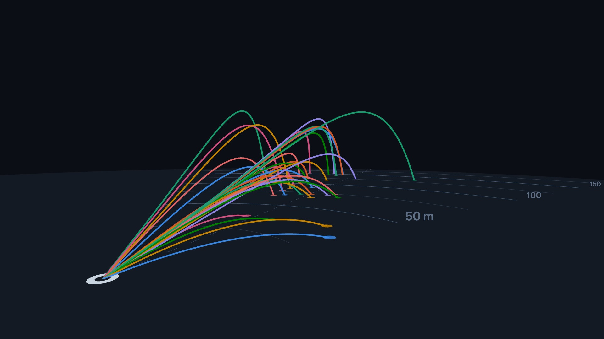 |

## palette

Ordered categorical colors, any CSS color. The default is CVD-validated for dark surfaces. Keys beyond the palette length render gray instead of cycling.

| `default` | `custom` a warm custom palette |
| --- | --- |
| 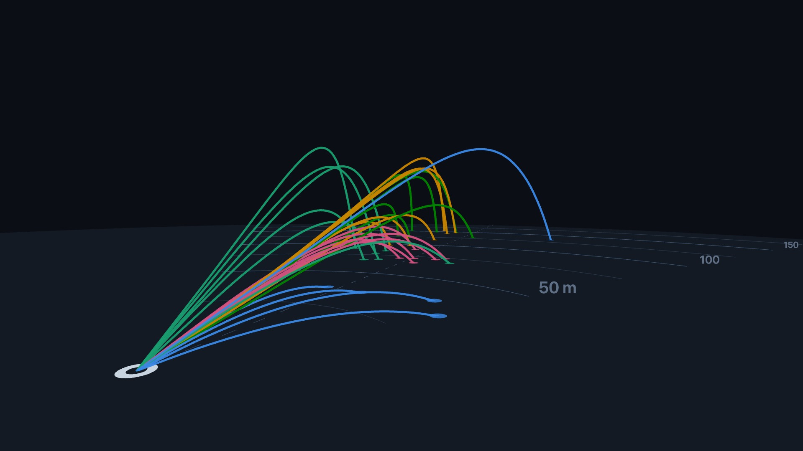 | 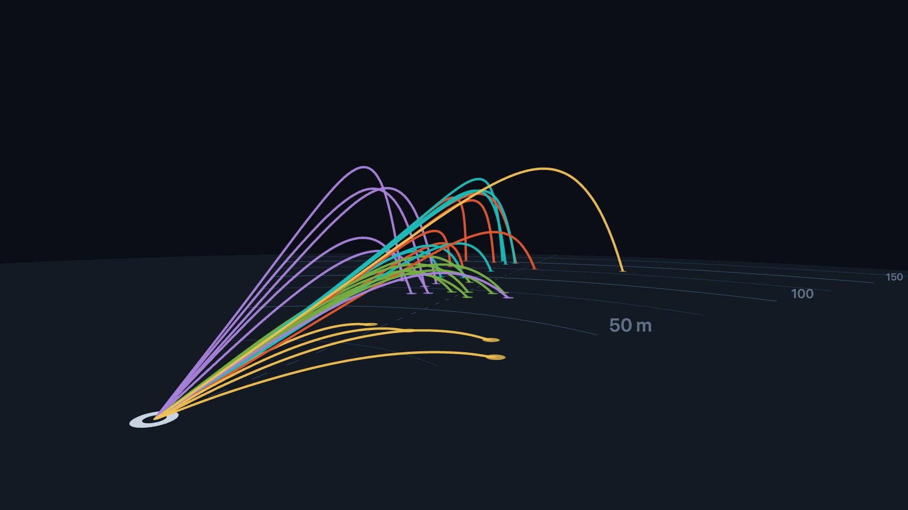 |

## background

Scene background as a CSS color, or null for a transparent canvas over whatever the page draws behind it. Fog matches the background color.

| `default` '#0b0e14' | `light` '#eef2f7' | `transparent` null, shown on a checkerboard |
| --- | --- | --- |
|  | 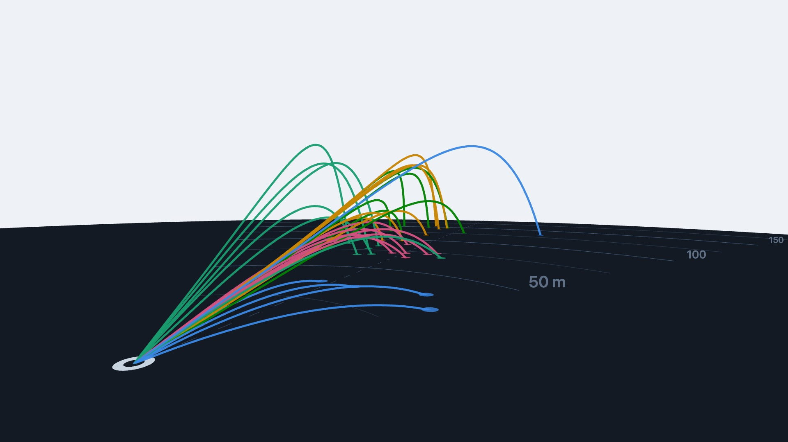 | 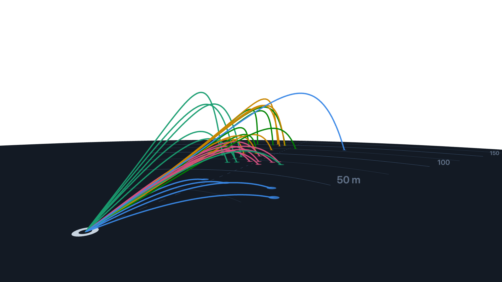 |

## groundColor

Floor disc color, any CSS color. The default blends into the dark theme. A turf green reads as grass.

| `default` '#131a24' | `green` '#215732' |
| --- | --- |
|  | 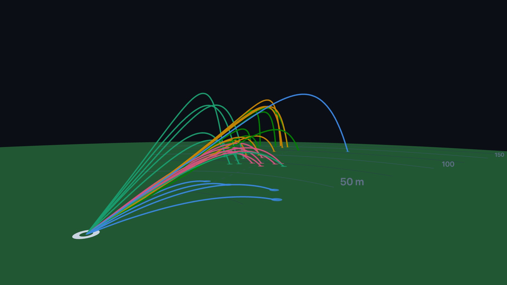 |

## units

Display units for the ground distance arcs and tooltips. Data stays meters either way.

| `meters` (default) | `yards` |
| --- | --- |
|  | 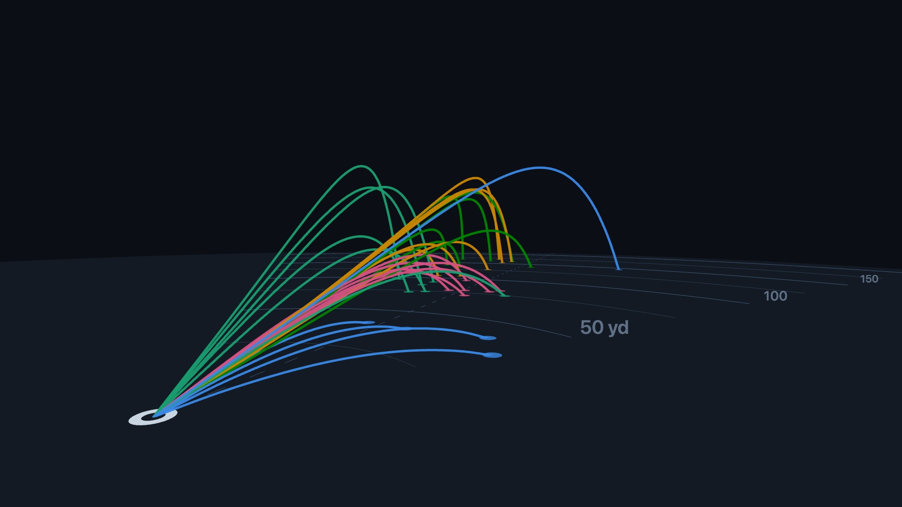 |

## rollout

Off clips each trajectory at the first touchdown, so what you see is carry. On renders the measured bounce and rollout points past it.

| `false` (default) | `true` |
| --- | --- |
|  | 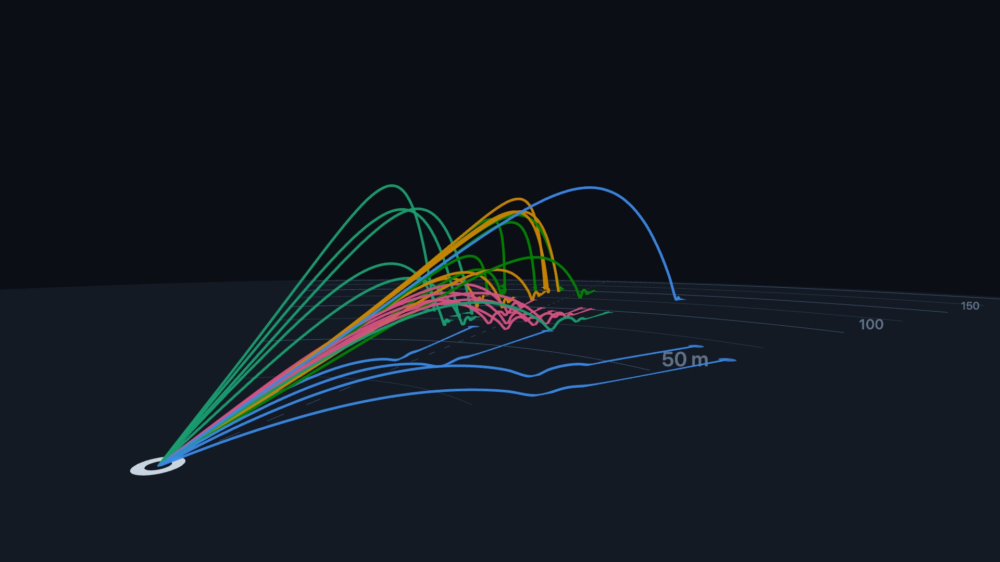 |

## autoRotate

Slow idle orbit around the scene. Good for kiosk or hero placements.

| `true` orbit speed as captured, not exact |
| --- |
| 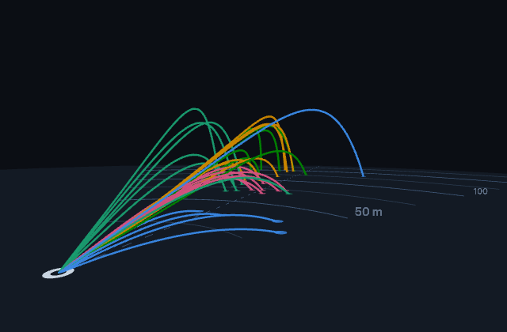 |

## play({ order })

volley launches every shot at once; fast balls visibly outpace slow ones. sequence staggers launches. Both GIFs are time-compressed.

| `volley` (default) | `sequence` |
| --- | --- |
| 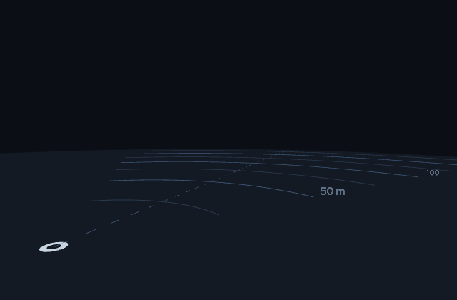 |  |

## select(id)

Selecting a shot dims the rest. Click a tracer or call select(id); select(null) clears.

| `selected` one shot selected |
| --- |
| 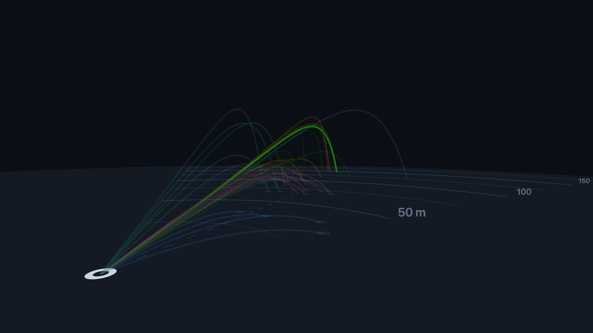 |

## Not pictured

- `tooltip` Built-in hover card with club, carry, apex, ball speed. A DOM overlay, so it only shows live. Try it in the demo.
- `speed` Playback rate multiplier. play({ speed }) or setSpeed().
- `loop` Restart the replay when it ends. play({ loop: true }).
- `stagger` Seconds between launches in sequence order. Default 1.2.

---

Fixtures are real TrackMan range shots, scrubbed to trajectories and
numbers only. TrackMan is a trademark of TrackMan A/S; this project is
not affiliated with or endorsed by TrackMan.
